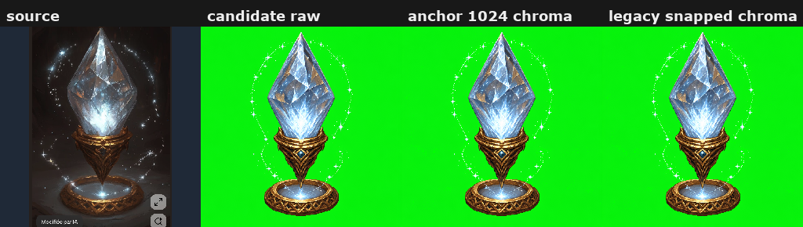

# Production Candidate Review

Review page for the front-facing identity production candidate before facing generation.

## Notes

- Accept `anchor-1024-chroma.png` before generating optional N/S/E/W anchors. `snapped-1024-chroma.png` remains as a compatibility alias.
- If identity or silhouette is wrong, regenerate the candidate rather than continuing.

## Review Assets

### Candidate Overview

Source, raw candidate, optional native snap, and 1024 chroma candidate.

[Open file](../../../review/candidate-overview.png)

### Source Image

Input source used for candidate generation.

[Open file](../../../input/source.png)

### Candidate Raw

Generated front-facing identity candidate.

[Open file](../candidate-raw.png)

### Snapped Native

Native pixel grid recovered by pixel snapper, when anchor snapping is enabled.

[Open file](../snapped-native.png)

### Anchor 1024 Chroma

Accepted candidate reference for direction generation.

[Open file](../anchor-1024-chroma.png)

### Legacy Snapped 1024 Chroma

Compatibility alias for tools that still expect snapped candidate paths.

[Open file](../snapped-1024-chroma.png)

### Candidate Manifest

Machine-readable candidate metadata.

[Open file](../candidate.json)
