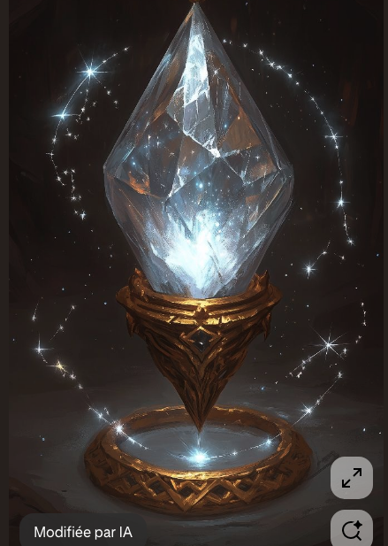

# mana-crystal-relic Bootstrap Anchors

Concrete text-or-image to front-facing platformer candidate and optional directional anchor bootstrap run.

## Notes

- Candidate facing: `front`.
- Directions: `none`.
- Candidate prompt preset: `high-fidelity-v1`.
- Anchor pixel snap: `disabled`.
- Game view: `generic`.
- Anchor role: `prop`.
- Use the 1024 chroma anchors as the stable references for animation generation.

## Review Assets

### Source Image

Generated or user-provided 1024x1024 source image.

[Open file](../../input/source.png)

### Front Candidate

Front-facing identity production candidate.

[Open file](../../candidate/front/snapped-1024-chroma.png)

### Bootstrap Metadata

Machine-readable run summary and canonical output paths.

[Open file](../../bootstrap.json)

### Anchor Wizard Review

Underlying anchor wizard review page.

[Open file](../index.md)
