# relic-use-s Review

Quick review page for the `s` facing `use` animation. Mode: `image`. Frames: `8`. FPS: `8`.

## Review Assets

### Generated Sheet

Full opaque pose board produced by the image model. Image size: `2048x1536`. Expected generation canvas: `2048x1536`.

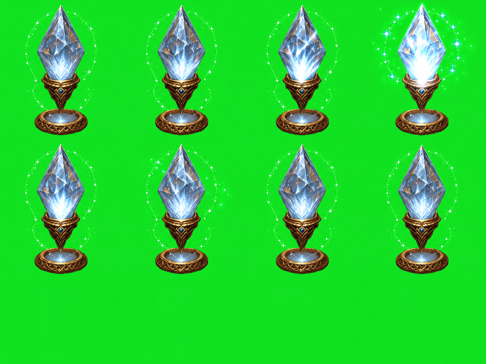

[Open file](../generated/sheet.png)

### Rough Grid Review Crops

First `8` implied grid cells cropped from the pose board for review only. These are not the runtime source of truth. Generation grid: `4x3`. Cell size: `512x512`. Review image size: `1352x204`.

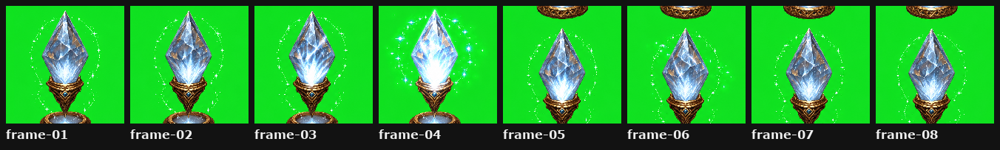

[Open file](grid-review-cell-contact.png)

### Rough Grid Review GIF

Implied grid crops looped for geometry review only. GIF canvas: `256x256`.

[Open file](grid-review-cell-preview.gif)

### Recovered Component Contact Sheet

Foreground components recovered from the full pose board and ordered by the declared grid. These recovered components are the runtime source. Review image size: `591x204`.

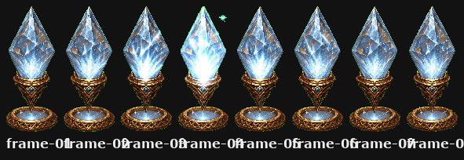

[Open file](recovered-component-contact.png)

### Recovered Native Contact Sheet

Recovered components placed on a shared padded native review canvas without scaling. This is the first animation review checkpoint before pixel snap or 256x256 runtime normalization. Review image size: `1208x204`.

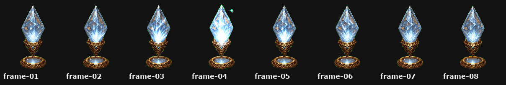

[Open file](recovered-native-contact.png)

### Recovered Native Preview GIF

Recovered components looped on the padded native review canvas before runtime normalization. GIF canvas: `512x576`.

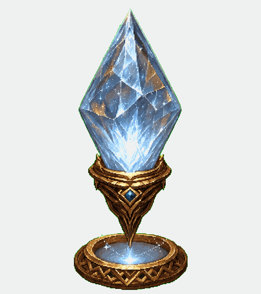

[Open file](recovered-native-preview.gif)

### Comparison 01: Grid Review To Recovered Components

Before/after comparison showing why implied grid crops are review artifacts only. Review image size: `1032x352`.

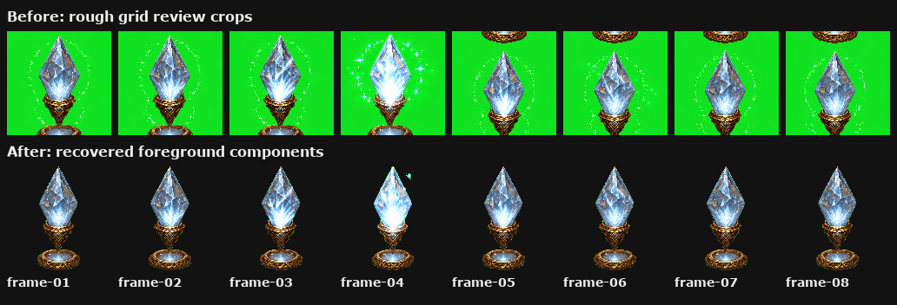

[Open file](compare-01-grid-review-to-recovered-components.png)

### Comparison 02: Recovered Components To Native Layout

Before/after comparison showing variable-size recovered components padded to a shared native review canvas without scaling. Review image size: `928x352`.

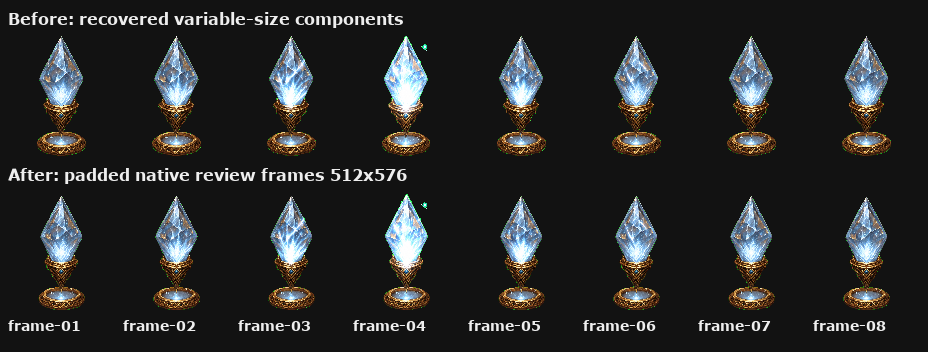

[Open file](compare-02-recovered-to-native-layout.png)

### Comparison 06: Cleaned To Scaled

Before/after comparison for cleanup output to shared-scale layout input. Review image size: `464x352`.

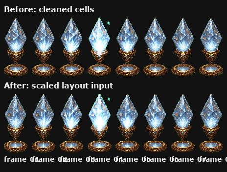

[Open file](compare-02-cleaned-to-scaled.png)

### Comparison 07: Scaled To Normalized

Before/after comparison for final placement into runtime cells. Review image size: `1032x352`.

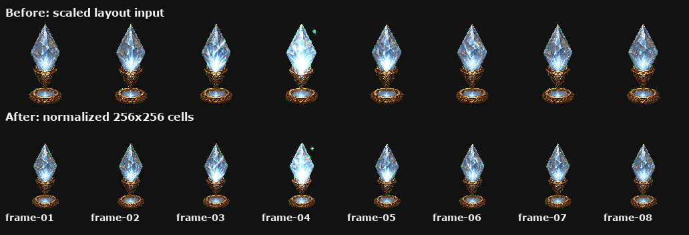

[Open file](compare-03-scaled-to-normalized.png)

### Normalized Contact Sheet

Final normalized frames after cleanup, scaling, and baseline alignment.

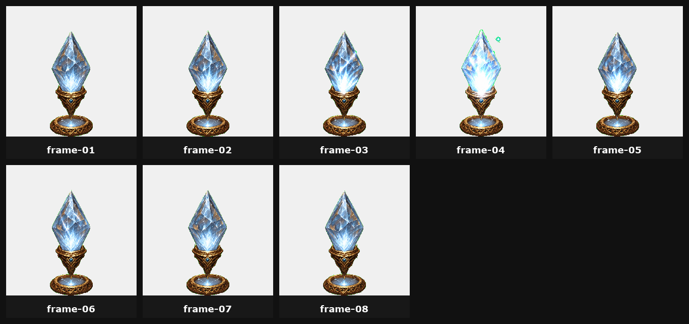

[Open file](contact.png)

### Normalized Preview GIF

Final runtime-cell animation preview.

[Open file](preview.gif)

### Runtime Spritesheet

Game-facing transparent spritesheet export. Image size: `1280x512`.

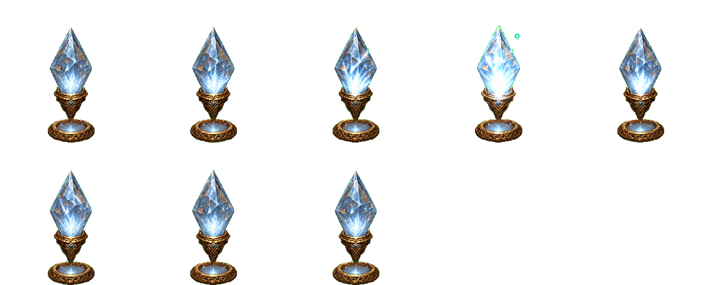

[Open file](../export/spritesheet.png)

### Runtime Preview GIF

Copy of the final preview GIF bundled with the export. GIF canvas: `256x256`.

[Open file](../export/preview.gif)

### Export Manifest

Machine-readable export metadata.

[Open file](../export/manifest.json)

### Baseline Report

Baseline and center audit from the final spritesheet.

[Open file](../export/baseline-report.json)
