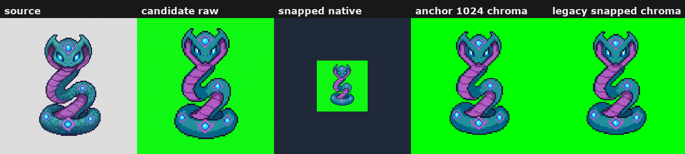
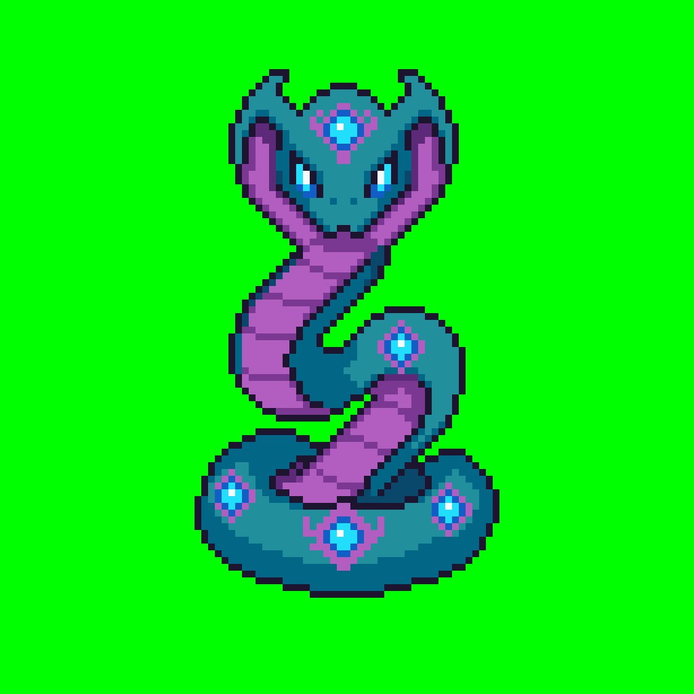

# source Anchor Wizard Review

Current review page for source, production candidate, and directional anchor setup.

## Notes

- Accept the production candidate before generating N/S/E/W anchors.
- Final animation references are the snapped 1024 chroma anchors under anchors/<direction>/.

## Review Assets

### Candidate Overview

Source and production candidate comparison.

[Open file](candidate-overview.png)

### Candidate Review

Detailed candidate checkpoint.

[Open file](../candidate/front/review/index.md)

### Accepted Candidate

1024 chroma candidate used for facing generation.

[Open file](../candidate/front/snapped-1024-chroma.png)
